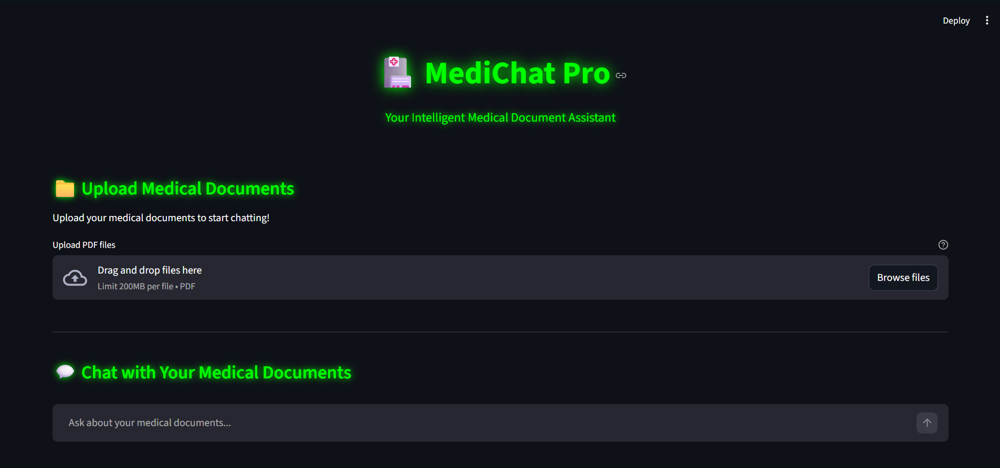

# 🏥 MediChat Pro - Medical Document Intelligence Assistant

<div align="center">
  


**Your Intelligent Medical Document Assistant**

</div>

## 📸 Application Interface

<div align="center">
  
</div>

The MediChat Pro interface features a sleek **neon green cyberpunk theme** with a dark background, providing an intuitive and modern interface for uploading and analyzing medical documents through an AI-powered chat interface.

## Overview

**MediChat Pro** is an intelligent medical document assistant powered by advanced AI and machine learning technologies. It enables healthcare professionals and researchers to upload medical documents (PDFs) and engage in intelligent conversations about the content, extracting insights and answers from complex medical documentation.

## ✨ Features

- **📄 PDF Document Upload**: Upload multiple medical documents for analysis
- **🧠 AI-Powered Analysis**: Leverages state-of-the-art language models for medical document understanding
- **💬 Interactive Chat Interface**: Ask questions and get intelligent responses based on your documents
- **🔍 Semantic Search**: Advanced vector-based search using FAISS for finding relevant medical information
- **📊 Document Processing**: Automatic text extraction and intelligent chunking for optimal analysis
- **🎨 Neon Green Cyberpunk Theme**: Modern, sleek dark interface with vibrant neon green accents

## 🛠 Technology Stack

### Core Technologies
- **Streamlit**: Interactive web application framework
- **LangChain & LangChain Community**: Advanced AI/ML orchestration and document processing
- **FAISS**: Facebook AI Similarity Search for efficient document retrieval
- **Sentence Transformers**: State-of-the-art embeddings for semantic understanding
- **PyTorch & Transformers**: Deep learning models for NLP
- **Euri AI**: Advanced language model API for intelligent responses

### Libraries & Dependencies
- `pypdf`: PDF document parsing and text extraction
- `scikit-learn`: Machine learning utilities
- `numpy & pandas`: Data manipulation and analysis
- `altair`: Data visualization

## 📋 Requirements

- Python 3.12+
- Virtual Environment
- 2GB+ available disk space (for model downloads)

## 🚀 Installation

### 1. Clone the Repository
```bash
git clone https://github.com/Aditya1198/MediChatPro.git
cd MediChatPro
```

### 2. Create Virtual Environment
```bash
# For Python 3.12
python -m venv venv
# Or using py launcher
py -3.12 -m venv venv
```

### 3. Activate Virtual Environment

**Windows (PowerShell):**
```powershell
.\venv\Scripts\Activate.ps1
```

**Windows (Command Prompt):**
```cmd
venv\Scripts\activate.bat
```

**macOS/Linux:**
```bash
source venv/bin/activate
```

### 4. Install Dependencies
```bash
pip install --default-timeout=1000 -r requirements.txt
```

## 🎯 Quick Start

### Running the Application

```bash
cd MediChatPro
.\venv\Scripts\Activate.ps1  # On Windows
streamlit run main.py
```

The application will start and be accessible at:
- **Local URL**: http://localhost:8501
- **Network URL**: http://192.168.1.x:8501 (your network IP)

### Using the Application

1. **Upload Documents**: Use the "📁 Upload Medical Documents" section to upload PDF files
2. **Process Documents**: Click the "🚀 Process Documents" button to analyze your files
3. **Ask Questions**: Use the chat interface to ask questions about your medical documents
4. **Get Insights**: Receive AI-powered responses based on the document content

## 📂 Project Structure

```
MediChatPro/
├── main.py                 # Main Streamlit application
├── requirements.txt        # Project dependencies
├── README.md              # This file
└── app/
    ├── __init__.py
    ├── config.py          # Configuration and API settings
    ├── chat_utils.py      # Chat model utilities
    ├── pdf_utils.py       # PDF processing functions
    ├── vectorstore_utils.py  # FAISS vector store operations
    └── ui.py              # UI components and helpers
```

## 🔧 Configuration

### API Setup

Edit `app/config.py` to add your Euri AI API key:

```python
EURI_API_KEY = "your-api-key-here"
```

### Model Settings

Customize model behavior in `app/chat_utils.py`:
- `MODEL`: Change the LLM model version
- `TEMPERATURE`: Adjust response creativity (0.0 = deterministic, 1.0 = creative)

## 🎨 Theme Customization

The application uses a neon green cyberpunk theme. To customize colors, edit the CSS in `main.py`:

```python
--neon-green: #00ff00;
--neon-green-light: #00ff44;
--dark-bg: #0a0a0a;
```

## 📊 Document Processing

The application processes documents through these steps:

1. **PDF Text Extraction**: Extracts text from uploaded PDF files
2. **Text Chunking**: Splits documents into 1000-character chunks with 200-character overlap
3. **Embedding Generation**: Creates semantic embeddings using Sentence Transformers
4. **Vector Indexing**: Stores embeddings in FAISS for fast retrieval
5. **Question Answering**: Uses retrieved context to generate accurate responses

## 🔐 Security & Privacy

- Documents are processed locally on your machine
- No permanent storage of uploaded documents
- Chat history is session-based and cleared on app restart
- Sensitive medical information should be handled according to HIPAA/local regulations

## 🐛 Troubleshooting

### Module Not Found Errors
```bash
# Reinstall dependencies
pip install --force-reinstall -r requirements.txt
```

### GPU/CUDA Issues
The application works on CPU. For GPU acceleration, install GPU-enabled PyTorch:
```bash
pip install torch torchvision torchaudio --index-url https://download.pytorch.org/whl/cu118
```

### Port Already in Use
```bash
# Use a different port
streamlit run main.py --server.port 8502
```

## 📈 Performance Tips

- For large documents (>100MB), process in batches
- Increase chunk overlap for better context preservation
- Use a GPU-enabled system for faster processing
- Clear chat history periodically for optimal performance

## 🤝 Contributing

Contributions are welcome! Please feel free to submit a Pull Request.

## 📝 License

This project is licensed under the MIT License - see the LICENSE file for details.

## 👥 Authors

- **Aditya1198** - Initial development

## 🙏 Acknowledgments

- LangChain team for excellent AI orchestration
- Streamlit for the amazing web framework
- FAIR (Facebook AI Research) for FAISS
- Hugging Face for transformer models and embeddings

## 📞 Support

For issues, questions, or suggestions, please open an issue on GitHub or contact the development team.

---

**Built with ❤️ for medical professionals and researchers**